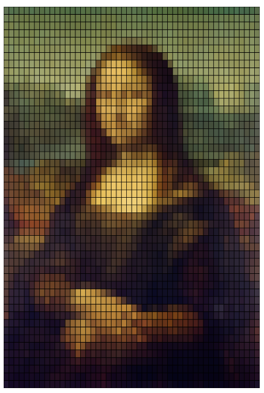

# Personal Final Project Description

## Interactive Description of the Work
Based on our group's code, my code is focused on user input and the interactions are described below.

### Mouse Interaction

- **Hover:**
Move the mouse over the circles (representing apples) to see their colors change, and when you move the mouse away, the colors return to their original state. The colors are randomized each time you hover, allowing you to choose the color you like now (while hovering, each apple will only keep the current random color.)

- **Click:**
Click on any apple to lock its color. The color will remain until the user presses the spacebar to reset it.

### Keyboard Interaction

- **Number Keys:**
Press 1, 2, 3, 4 to switch between seasons (Winter, Spring, Summer, Fall), and each with its own background and music.

- **Arrow Keys:**
Use the Left Arrow and Right Arrow keys to change the size of the apples, resize all apples by ±2 pixels, and set the maximum size limit of the apple to ±20 pixels.

- **Spacebar:**
Press Spacebar to reset all apple colors to their original values.

## Personalized Animation Approach

### Approach
My approach to animation uses user interaction with the apple tree and seasonal visual themes to enhance the experience. Mouse movement and keyboard input create a unique level of interactivity, making the scene responsive to user actions.

### Driver
The primary driver for my code is direct interaction, allowing the user to influence colors, seasonal background, and apple size, thereby giving control over the look and feel of the tree.

## Unique Animated Properties

### Color and Size Variation
Each apple's color changes on hover, and size adjustments are available through keyboard inputs, creating a distinctive look. This differs from other group members' contributions.

### Seasonal Background and Music
Every season comes with unique visuals and sounds, offering an immersive, multi-sensory experience.

##  Technical Explanation

- **Class-Based Structure:**
Apples are represented as instances of the 'MyCircleClass', each with its unique position, color, size, and interaction states. This setup allows each circle to independently react to user interactions, such as hovering and clicking.

- **Event Handlers:**
mousePressed() and keyPressed() manage interactions for color changes, size adjustments, and seasonal transitions.

- **Continuous Animation:**
The draw() function keeps rendering the scene, ensuring a smooth update of colors, sizes, and seasonal visuals as per user inputs.

- **The Use of Array**
1. **Storing Circle Objects:** The myCircles array is used to store instances of the MyCircleClass, each representing an apple on the canvas. This structure enables easy access to each object and allows us to apply consistent operations across all instances.

2. **Batch Operations:** In functions like draw() and mousePressed(), we use the forEach() method to iterate through the myCircles array. By applying forEach(), we can perform the same action on each object in the array, such as detecting mouse interactions or updating graphical states. This batch processing makes the code more concise and easier to manage.

## Changes to Group Code
Introduced seasonal backgrounds and music, allowing users to switch between seasons dynamically.

Added hover and click functionalities for color changes, offering a more personalized experience for each apple.

Integrated size adjustment for apples using arrow keys, allowing further customization and interaction with the tree.

Added tree trunks so that when the user reduces the size of apples through interaction, branches can connect them

## External Tools and Techniques

- **Color Mode:**
Temporarily switched to HSB color mode to allow for rich, varied colors during interaction.

- **External Assets:**
The background image is drawn by myself, and the background music is downloaded from the Internet

- **p5.js Library:**
Used for creating animation.

## References for Techniques and Inspiration

### Interactive Art
[p5.js Documentation](https://p5js.org/) was referenced for creating interactive animations and handling events.

### Nature and Seasonal Themes
[Monet's Four Seasons series of paintings](https://claudemonetgallery.org/), which depict the changing seasons through different tones, provided me with color inspiration for the four seasons theme.

The inspiration for the interaction with the apple tree comes mainly from the tutorial in Week 8.
 